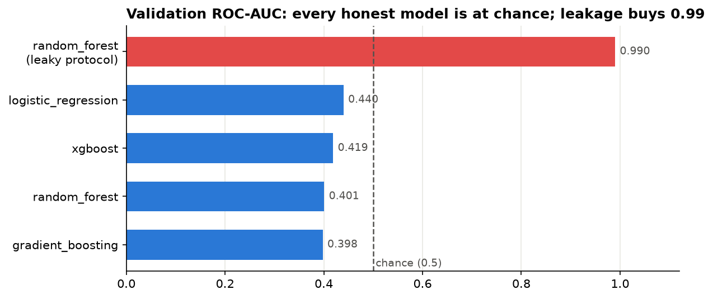

# Disease Prediction — Anatomy of a "Perfect" Classifier

An imbalance-aware, **leakage-free** binary classification pipeline — and a forensic case study of how a data leak manufactured a validation ROC-AUC of **0.997 out of pure noise**.



## The story

This project began as second-year coursework: predict a binary `diagnosis` (~5% positive) from 10 anonymized patient features. The original notebook reported ROC-AUC ≈ 0.997 and looked like a triumph.

Revisiting it with a correct evaluation protocol:

| | Protocol | Validation ROC-AUC |
|---|---|---|
| ❌ Original | ADASYN oversampling **before** the split, transformer fit on test data | **0.99** — fabricated by leakage |
| ✅ Rebuilt | Split first; SMOTE + scaling inside CV folds (`imblearn.Pipeline`) | **≈ 0.5** — chance level |

The dataset's features turn out to carry **no signal at all** (near-zero mutual information with the target; four tuned model families all score at chance). Oversampling before splitting had planted synthetic near-copies of validation patients inside the training set, letting a random forest "memorise" its way to a perfect score.

To show the rebuilt pipeline is sound rather than merely pessimistic, the same code path applied to a real diagnostic dataset (Wisconsin breast cancer) reaches an honest, leakage-free **ROC-AUC ≈ 0.995** — and the test suite verifies every candidate pipeline recovers a planted signal under cross-validation.

Full narrative with figures: [`notebooks/disease_prediction_analysis.ipynb`](notebooks/disease_prediction_analysis.ipynb).

## What the pipeline does right

- **Fold-safe resampling** — SMOTE lives inside an `imblearn.Pipeline`, so it is re-fit on training folds only; validation folds are never resampled.
- **Stratified everything** — the 80/20 validation split and the 5-fold CV both preserve the 19:1 class ratio.
- **Imbalance-appropriate metrics** — model selection on ROC-AUC / PR-AUC, never accuracy (an always-negative model is 95% "accurate" here).
- **Explicit threshold tuning** — the decision threshold is tuned on the held-out validation split, not assumed to be 0.5.
- **Fail-fast data validation** — schema, missingness, and label checks before any training.
- **Tested** — `pytest` suite covers validation logic, threshold tuning, and an end-to-end check that each candidate learns a planted signal without leaking.

## Repository structure

```
├── data/
│   ├── disease_train.csv        # 4,000 patients × 10 features + diagnosis (course dataset)
│   └── disease_test.csv         # 1,000 unlabelled patients
├── notebooks/
│   └── disease_prediction_analysis.ipynb   # the full case study, executed
├── src/disease_prediction/
│   ├── config.py                # paths, constants
│   ├── data.py                  # loading + fail-fast validation
│   ├── pipeline.py              # candidate pipelines & hyperparameter grids
│   ├── evaluate.py              # metrics + threshold tuning
│   ├── train.py                 # model selection protocol (python -m disease_prediction.train)
│   └── predict.py               # test-set scoring (python -m disease_prediction.predict)
├── models/                      # final_model.joblib + metrics.json (generated)
├── reports/                     # figures + test_predictions.csv (generated)
└── tests/test_pipeline.py
```

## Quickstart

Requires Python 3.10+.

```bash
git clone <this-repo>
cd disease-prediction

python -m venv .venv && source .venv/bin/activate   # Windows: .venv\Scripts\activate
pip install -e ".[dev]"

pytest                                  # sanity checks (~40s)
python -m disease_prediction.train     # grid-search 4 model families, save model + metrics
python -m disease_prediction.predict   # score the test set -> reports/test_predictions.csv
jupyter lab notebooks/disease_prediction_analysis.ipynb
```

## Lessons learned

1. **Resample after you split, never before** — and make the mistake structurally impossible by putting the resampler inside the pipeline.
2. **A too-good number is a bug report.** 0.997 AUC from 10 anonymous features should trigger an audit, not a celebration.
3. **Never fit any transformer on test data.**
4. **Negative results are results** — proving the dataset unlearnable, and explaining precisely how the fake score arose, is the real deliverable.

## Tech stack

Python · scikit-learn · imbalanced-learn · XGBoost · pandas · Matplotlib · pytest

## License

[MIT](LICENSE)
