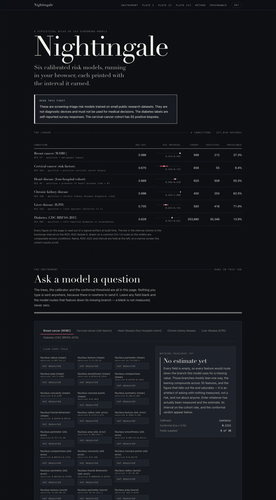

# Nightingale

[](https://github.com/safdar-hussain1/nightingale/actions/workflows/tests.yml)

Calibrated screening-triage risk models for six clinical conditions, built so
every published number arrives with its uncertainty attached — and so the
model you read about is provably the model that runs.

**[Live dashboard](https://safdar-hussain1.github.io/nightingale/)** — all six
models run entirely in the visitor's browser, from the same exported bundles
this repository ships.



> These are screening-triage risk models trained on small public research datasets. They are not diagnostic devices and must not be used for medical decisions. The diabetes labels are self-reported survey responses. The cervical-cancer cohort has 55 positive biopsies.

**Run it in 30 seconds — no install, no API key, no network:**

```bash
git clone https://github.com/safdar-hussain1/nightingale.git
cd nightingale
open docs/index.html            # Linux: xdg-open docs/index.html
```

That one file *is* all six models. For the Python side — the CLI, the tests, a
retraining run — see [Quickstart](#quickstart) and
[Every command](#every-command).

## What it does

Six conditions, one pipeline: fetch (SHA-256-pinned) → clean → nested-CV train
with held-out calibration → bootstrap-interval evaluation → conformal
prediction sets → browser export → signed manifest.

| Condition | Source | Cohort | Positives | ROC-AUC [95% CI] |
|---|---|---:|---:|---|
| Breast cancer (WDBC) | UCI 17 | 569 | 212 | 0.9864 [0.9759, 0.9948] |
| Cervical cancer (risk factors) | UCI 383 | 858 | 55 | 0.6703 [0.5942, 0.7452] |
| Heart disease (four hospitals) | UCI 45 | 920 | 509 | 0.8892 [0.8663, 0.9101] |
| Chronic kidney disease | UCI 336 | 400 | 250 | 0.9979 [0.9937, 1.0000] |
| Liver disease (ILPD) | UCI 225 | 583 | 416 | 0.7051 [0.6626, 0.7451] |
| Diabetes (CDC BRFSS 2015) | UCI 891 | 253,680 | 35,346 | 0.8288 [0.8268, 0.8309] |

Every figure is computed on out-of-fold predictions from a 5×3 nested
cross-validation, with 2,000-replicate stratified bootstrap intervals. Full
per-condition metrics — PR-AUC, Brier, ECE, conformal q̂, subgroup gaps — are
in [`MODEL_CARD.md`](MODEL_CARD.md).

Two of those rows deserve to be read sceptically, and the model card says so at
length. **Cervical cancer** discriminates modestly (0.67) on 55 positives out of
858 — an honestly weak result, published as measured. **Chronic kidney disease**
scores 0.998 because that 400-row benchmark is close to separable by
construction: ten categorical clinical findings split the two classes perfectly,
and missingness alone carries up to 0.72 AUC. Read it as "this published
benchmark is easy", not as "a deployed screener would score 99.8%".

## What makes it rigorous

- **Calibration first, and cross-fitted.** Every reported calibrated metric
  comes from probabilities produced by a calibrator that never saw the row it
  is scoring: for each outer fold, the isotonic calibrator is fit only on
  out-of-fold rows from the *other* folds. An earlier in-sample version of this
  produced ECE around 1e-19 — a number too good to be a result, and a bug
  report instead. The deployment calibrator (fit on the whole pooled OOF frame)
  is kept as the exported artifact, but no published metric is computed from it.
- **Conformal "uncertain" sets.** Split-conformal prediction at α = 0.1 gives
  each condition a q̂ and lets the model abstain rather than guess. Heart
  disease returns "uncertain" on 19.46% of rows, liver disease on 47.17%,
  diabetes on 7.61%. Kidney disease has q̂ = 0.0 and therefore **can never
  return "uncertain"** — disclosed everywhere its verdicts appear.
- **Bootstrap intervals everywhere.** No point estimate is published without
  one; each metric draws from its own bootstrap seed stream, so the four
  intervals are not artificially correlated.
- **Decision-curve analysis.** Net benefit against treat-all and treat-none
  across 99 thresholds, per condition, so "is this model worth using at the
  threshold I care about" has an answer that AUC cannot give.
- **Leakage sentinels with mutation tests.** A statistical detector flags
  sentinel-coded zeros; the site-scoped cholesterol rule is verified by
  deliberately breaking it and confirming the test goes red. Calibrator
  hold-out is asserted live inside the transfer study, not trusted to
  `train_test_split`.
- **Missing-tolerant inference.** Blank fields are missing, never zero. The
  browser walker maps `null`, `""`, whitespace and non-numeric strings to NaN —
  measured on the real heart-disease bundle, treating blanks as `0` instead
  moved a prediction from 0.8462 to 0.1350 and flipped the verdict.
- **Signed provenance.** An Ed25519 signature over a SHA-256 manifest of all 34
  generated artifacts, plus per-model canary fingerprints that identify a lone
  `model.json` even if it has been renamed and stripped of its metadata.

## The four-hospital transfer study

The heart-disease cohort is four hospitals in one file — Cleveland, Hungary,
Switzerland, VA Long Beach — with prevalence from 36.1% to 93.5%. That makes it
a real external-validation bench, so the study trains on **Cleveland only**
(303 rows, the highest-quality site) and deploys that model, unmodified, at the
three hospitals it never saw. **Heart disease is the only one of the six
conditions with any external validation at all** — the other five were each
trained and evaluated within a single cohort, and nothing here establishes that
they would transfer anywhere.

**Zero-effort deployment, whole site, no site-local data at all:**

| Site | n | Prevalence | ROC-AUC [95% CI] | ECE [95% CI] | Calibration slope |
|---|---:|---:|---|---|---:|
| Hungary | 294 | 36.05% | 0.8709 [0.8277, 0.9116] | 0.1579 [0.1356, 0.1883] | 0.958 |
| Switzerland | 123 | 93.50% | 0.7832 [0.6397, 0.9163] | 0.2065 [0.1698, 0.2471] | 0.962 |
| VA Long Beach | 200 | 74.50% | 0.6900 [0.5980, 0.7744] | 0.0782 [0.0534, 0.1487] | **0.478** |

Discrimination partly transfers — no site's interval touches chance.
Calibration does not transfer at all.

**Intercept-only recalibration**, fit on a seeded 30% site-local split and
scored on the held-out 70%. Both columns below are computed on the *identical*
evaluation rows, so the before/after comparison is like-for-like:

| Site | n (eval) | Fitted intercept | ECE naive → recalibrated | ROC-AUC (identical, by construction) |
|---|---:|---:|---|---|
| Hungary | 206 | −1.050 | 0.1585 [0.1330, 0.1980] → **0.0466 [0.0282, 0.1028]** | 0.8641 |
| Switzerland | 87 | +2.151 | 0.2007 [0.1543, 0.2512] → **0.0305 [0.0102, 0.0809]** | 0.7500 |
| VA Long Beach | 140 | +0.415 | 0.0697 [0.0491, 0.1432] → 0.0918 [0.0693, 0.1410] | 0.7439 |

The two AUC columns are equal to the bit — a monotone logit shift cannot move a
rank statistic — and the test suite asserts that on the literal published JSON
fields, not on a conveniently-paired nested one.

**The `chol = 0` sentinel.** Every one of Switzerland's 123 rows records serum
cholesterol as exactly `0`, which is physiologically impossible; VA does the
same on 49 of its 200. A model trained where cholesterol is genuine reads those
zeros as extreme-low cholesterol and fails silently. The cleaner converts them
to NaN, scoped to those two sites only, so Cleveland's real low readings
survive — and the sentinel detector confirms the handover by flagging `chol` on
raw Switzerland at a zero-fraction of 1.0000 and no longer flagging it after
cleaning.

**VA is the honest negative result.** Its naive calibration slope is 0.478, far
from the 1.0 that Hungary (0.958) and Switzerland (0.962) sit near — VA's
problem is not a prevalence shift but a risk gradient that is too steep for how
its outcomes are actually distributed. Intercept-only recalibration can correct
a shift, not a slope, so it does not help here: on the matched 140 evaluation
rows, ECE goes 0.0697 → 0.0918 and Brier is flat (0.158 → 0.162), while the
0.478 slope above is the whole-site figure. The intervals overlap heavily, so the
honest statement is "recalibration did not demonstrably help VA", not
"recalibration hurt VA". It is published as measured either way.

## Quickstart

Requires Python 3.12+.

```bash
git clone https://github.com/safdar-hussain1/nightingale.git
cd nightingale

python3 -m venv .venv
source .venv/bin/activate        # Windows: .venv\Scripts\activate

pip install -r requirements.txt  # pinned versions that reproduce the numbers
pip install -e ".[dev]"          # then the package itself, plus pytest

pytest -q
```

Those exact steps were run against a fresh clone in a fresh `python3 -m venv`
on macOS: `586 passed, 10 skipped, 8 deselected`. Nine of the skips are the
tests that need `data/raw/`, which is gitignored — each skip message names the
one-line fetch call that would populate it (`nightingale fetch` fetches all six
at once). The tenth is the check that the private signing key matches
`provenance/pubkey.pem`, which runs only when `NIGHTINGALE_SIGNING_KEY` is set
to the key's path. The eight deselected are network-marked.

<details>
<summary><strong>If <code>pytest</code> or <code>nightingale</code> says <code>ModuleNotFoundError: No module named 'nightingale'</code></strong></summary>

The editable install's path file did not reach `sys.path`. It does not happen
with the `python3 -m venv` above, but it does happen in some `uv`-built venvs.
The fix is to put the sources on the path yourself:

```bash
export PYTHONPATH=src
```

Do **not** "fix" it with a non-editable `pip install .`. That copies the package
into `site-packages`, so every path derived from `Path(__file__).parents[...]`
resolves inside the venv instead of the repository, and the committed data and
model bundles stop loading.

</details>

The trained models, cleaned datasets and metrics are all committed, so nothing
below needs a training run to work.

```bash
nightingale evaluate --condition heart-disease
```

```
heart-disease: n=920 prevalence=0.5533  roc_auc=0.8892 [0.8663, 0.9101]  pr_auc=0.8892 [0.8616, 0.9167]  brier=0.1280 [0.1145, 0.1425]  ece=0.0236 [0.0202, 0.0536]
```

Score one row. Unset features are missing (NaN), never zero:

```bash
nightingale predict --condition heart-disease \
  --set age=58 --set sex=1 --set cp=4 --set thalach=140 --set oldpeak=1.5
```

```
condition: heart-disease
p_raw: 0.871399
p_cal: 0.846154
verdict: positive
provenance: commit=fa455101d29542eec2f71c7bbc39659f5f65d649 built_utc=2026-08-14T08:24:50Z author=Safdar Hussain
```

Going back to raw data is two commands. `fetch` verifies a pinned SHA-256 for
every file it lands and touches the network only when the cache is empty;
`clean` writes a byte-deterministic gzip, so a re-run leaves the signed
artifact unchanged:

```bash
nightingale fetch --condition heart-disease
nightingale clean --condition heart-disease
```

```
heart-disease: fetched -> /path/to/nightingale/data/raw/heart-disease
heart-disease: cleaned -> /path/to/nightingale/data/cleaned/heart-disease.csv.gz
```

Retraining one condition (the full six-condition run takes about six and a
half minutes end to end on a laptop — the committed `run_meta.json` records
the exact wall-clock; heart disease alone is the 18–20s below):

```bash
nightingale train --condition heart-disease
```

```
=== heart-disease (Heart disease (four-hospital cohort)) ===
  n=920 prevalence=0.5533 roc_auc=0.8892 [0.8663, 0.9101]  pr_auc=0.8892 [0.8616, 0.9167]  brier=0.1280 [0.1145, 0.1425]  ece=0.0236 [0.0202, 0.0536]  q_hat=0.6842 uncertain_rate=0.1946  wall=19.5s
  wrote models/heart-disease/metrics.json
  wrote models/heart-disease/oof_predictions.csv.gz
  wrote reports/figures/heart-disease-reliability.png
  wrote reports/figures/heart-disease-decision-curve.png

Total wall-clock (this invocation): 19.5s across 1 conditions
```

Wall-clock is the only thing that moves between runs — the metrics and the
written artifacts are byte-identical, because training is a deterministic
function of `seed=42` and the gzip container pins `mtime=0`.

That bit-identity is a promise about *one machine*, and the test suite says so
in two separate assertions. Re-exporting on the same platform gives identical
bytes; against the committed bundles, which were built on macOS/arm64, the
suite allows a 1e-6 relative tolerance, because leaf values are stored float32 and
XGBoost's histogram arithmetic lands on a neighbouring float32 on another
architecture — CI on linux/x86_64 produced `0.04965406656265259` where this
machine produced `0.04965406283736229`, one float32 ULP apart. That cannot move a prediction, but
it is not bit-identity, so the repository does not claim it is. Structure —
tree shapes, feature names, calibrator type — is compared exactly.

There is deliberately no top-level `--condition`: argparse lets a subparser's
flag silently shadow a same-named top-level one, so the flag is defined in
exactly one place.

## Every command

The whole surface, in one block. Every line below was executed against this
commit except the two that are marked; absolute paths in sample output are
written as `/path/to/nightingale`.

```bash
# --- setup, once -----------------------------------------------------------
git clone https://github.com/safdar-hussain1/nightingale.git
cd nightingale
python3 -m venv .venv
source .venv/bin/activate           # Windows: .venv\Scripts\activate
pip install -r requirements.txt     # pinned versions that reproduce the numbers
pip install -e ".[dev]"             # the package itself, plus pytest

# --- the six conditions ----------------------------------------------------
# Every --condition takes exactly one of:
#   breast-cancer  cervical-cancer  diabetes
#   heart-disease  kidney-disease   liver-disease
# Omit --condition and the subcommand runs all six.
nightingale --help                  # the nine subcommands
nightingale train --help            # every flag of one subcommand

# --- data ------------------------------------------------------------------
nightingale fetch --condition heart-disease           # SHA-256-pinned; network only when data/raw is empty
nightingale fetch --condition heart-disease --force   # re-download even when cached
nightingale clean --condition heart-disease           # -> data/cleaned/<slug>.csv.gz
nightingale clean                                     # all six; byte-deterministic, so a re-run changes nothing

# --- train, measure, validate ----------------------------------------------
nightingale train --condition heart-disease           # ~20s. All six: ~6.5 min — see "Before you demo it"
nightingale evaluate --condition heart-disease        # ~4s, recomputed from the committed OOF predictions
nightingale evaluate --condition heart-disease --json
nightingale evaluate                                  # all six: ~2 min, because diabetes is 253,680 rows
nightingale external                                  # the four-hospital transfer study, ~25s
nightingale external --seed 42 --json

# --- export, sign, verify --------------------------------------------------
nightingale export --condition heart-disease --out-dir /tmp/nightingale-export
nightingale export --condition liver-disease --seed 42 --out-dir /tmp/nightingale-export
nightingale export --condition heart-disease          # in place, into models/ — read the hazard note first
nightingale sign                                      # key holder only: reads NIGHTINGALE_SIGNING_KEY
nightingale sign --key path/to/private.pem --out provenance/manifest.json   # not run here: needs the private key
nightingale verify                                    # 34 artifacts + signature; exit 0 / non-zero
nightingale verify --json
nightingale verify --manifest provenance/manifest.json --key provenance/pubkey.pem
nightingale verify --fingerprint models/kidney-disease/model.json

# --- score one row ---------------------------------------------------------
nightingale predict --condition heart-disease --set age=58 --set sex=1 --set cp=4 --set thalach=140 --set oldpeak=1.5
nightingale predict --condition kidney-disease --set sg=1.020 --set al=0 --set hemo=15.4 --json

# --- tests -----------------------------------------------------------------
pytest -q                           # the suite; network-marked tests are deselected by default
pytest -q tests/test_parity.py      # just the Python-vs-JavaScript parity gate
pytest -q -m network                # the 8 tests that do hit the network

# --- the dashboard ---------------------------------------------------------
python scripts/build_dashboard.py   # scripts/dashboard_template.html + artifacts -> docs/index.html
open docs/index.html                # macOS
xdg-open docs/index.html            # Linux — not run here: this machine is macOS
python3 -m http.server 8000 --directory docs   # then open http://localhost:8000
```

`nightingale sign` is the one subcommand a visitor cannot run: the Ed25519
private key is kept outside the repository, so a clone can `verify` but never
re-sign. Everything else works from a plain checkout.

### View the dashboard locally

`docs/index.html` is self-contained — the six model bundles, the walker, the
figures and the styles are all inlined, and the page never calls `fetch()` at
runtime. So the file scheme is enough:

```bash
open docs/index.html                # macOS
xdg-open docs/index.html            # Linux
```

A local server is not required, but it is the honest way to check two things
the `file://` scheme cannot show you: that the page behaves under the same
origin and MIME types GitHub Pages will serve it with, and that
`docs/assets/walker.js` — the standalone copy the parity test scores, which
the page inlines rather than links — is really being published beside it.

```bash
python3 -m http.server 8000 --directory docs
```

```
HTTP 200  723054 bytes  text/html
```

Then open `http://localhost:8000`. Append `?selftest=1` to either scheme to
make the page re-score its own canaries and report the result in the tab
title; `?theme=dark` and `?theme=light` pin the plate.

### Before you demo it

Three things worth knowing before you run this in front of someone.

**Training is safe.** `nightingale train` is byte-reproducible. Retraining
heart-disease rewrites `metrics.json`, `oof_predictions.csv.gz` and both
figures, and `nightingale verify` still passes — only `models/run_meta.json`
changes, because it records wall-clock, which is why it is deliberately left
out of the signed manifest. Nothing about a demo requires you to avoid
retraining.

**`nightingale export` will break `verify` after any new commit.** The export
stamps the current `HEAD` into each bundle's provenance block, so re-exporting
against a commit later than the one the manifest was signed at rewrites a
signed file:

```
TAMPERED: models/heart-disease/model.json
signature: valid
TAMPERED
```

Exit code 1. The signature is still valid — it is the *artifact* that no
longer matches the hash that was signed. Recovery is one command, because the
bundles are committed:

```bash
git checkout -- models/
```

The alternative, available only to the key holder, is to re-sign:
`nightingale sign` then `nightingale verify`. If you have nothing to re-export,
the safe way to show the command is to send it somewhere else with
`--out-dir /tmp/nightingale-export`, which touches nothing tracked.

**Timing.** `nightingale evaluate --condition <one>` takes about four seconds
and writes nothing — that is the one to run live. Prefer it to `train`, which
is about 20s for heart disease and about six and a half minutes for all six.
`nightingale evaluate` with no `--condition` is about two minutes, nearly all
of it diabetes' 253,680-row bootstrap. `nightingale fetch` only touches the
network when `data/raw/` is empty, so a warm checkout demos offline; on a cold
one, fetch before the audience arrives.

## The browser runs the real model

The dashboard does not call an API and does not load an ML runtime. Each
condition's gradient-boosted trees are exported to a plain JSON bundle, and
a single 268-line JavaScript file (`docs/assets/walker.js`) walks them directly.

**Parity gate: 1e-9, measured worst case 7.22e-16.** Across 1,200 cases (200
per condition, half drawn from real cleaned rows, a quarter with 1–4 blanked
fields), the largest disagreement between the Python reference walker and
`node docs/assets/walker.js` on the calibrated probability is 7.22e-16 — six
orders of magnitude inside the gate. All 1,200 conformal verdict strings agree
exactly. Getting there required two fixes that would otherwise have shipped
plausible-looking wrong probabilities: split comparisons must happen in
**float32** (both the input and the stored threshold), and XGBoost's JSON dump
omits the split condition entirely on indicator-typed features, which affected
51 of kidney disease's nodes.

**Self-test hook.** Open the dashboard with `?selftest=1` and the page re-scores
all six models' stored canary inputs through its own inlined walker, comparing
against the committed probabilities at 1e-12 and putting the result in the page
title:

```bash
"/Applications/Google Chrome.app/Contents/MacOS/Google Chrome" --headless \
  --virtual-time-budget=8000 --dump-dom "file://$PWD/docs/index.html?selftest=1" \
  | grep -o "<title>[^<]*"
# -> NIGHTINGALE SELFTEST PASS max=0.000e+0
```

Exactly zero, across 6 conditions × 8 canaries.

**Accuracy per KB.** The budget was 300 KB gzipped per bundle. Nothing came
close, so no model was traded down for size:

| Condition | Trees | Nodes | Raw | `gzip -9` | % of budget |
|---|---:|---:|---:|---:|---:|
| breast-cancer | 300 | 1,678 | 112,239 B | 17,896 B | 5.8% |
| cervical-cancer | 100 | 1,600 | 96,935 B | 15,330 B | 5.0% |
| diabetes | 300 | 2,100 | 130,921 B | 21,459 B | 7.0% |
| heart-disease | 100 | 700 | 44,257 B | 7,903 B | 2.6% |
| kidney-disease | 100 | 638 | 43,267 B | 7,220 B | 2.4% |
| liver-disease | 100 | 620 | 38,911 B | 6,720 B | 2.2% |

All six together are 76,528 B gzipped. The whole dashboard, models inlined, is
718,166 B (143,052 B gzipped) in a single self-contained file.

## Provenance — it's signed

```bash
nightingale verify
```

```
OK: data/cleaned/breast-cancer.csv.gz
OK: data/cleaned/cervical-cancer.csv.gz
...
OK: reports/figures/liver-disease-reliability.png
signature: valid
OK
```

34 artifacts, each hash recomputed from the file actually on disk, then an
Ed25519 signature checked over the manifest. Exit code 0 on success, non-zero
on any mismatch. The public key is `provenance/pubkey.pem`; its fingerprint —
the SHA-256 of the raw 32-byte key — is

```
49e4e52d6015eb7398cc04b0fd8fcb8fc5a82cd3a501836af55bb15518bd17a8
```

and it is printed in the dashboard footer beside the `openssl` pipe that
recomputes it. Compare it out-of-band before trusting a checkout: a copy
re-signed by someone else, with their key committed in place of this one, will
verify happily against itself.

Signature aside, every `models/<slug>/model.json` carries a canary block —
deterministic inputs plus the probability this project's own code gives them.
Given a lone bundle found anywhere, `verify --fingerprint` says which of the six
conditions it is a copy of, even renamed and stripped of its metadata:

```bash
nightingale verify --fingerprint models/kidney-disease/model.json
```

```
models/kidney-disease/model.json: matches kidney-disease
```

It does that by running each *registered* condition's own canary inputs through
both the reference trees and the candidate's trees and comparing the
pre-calibration outputs — never trusting anything the candidate file says about
itself, and never letting the candidate choose the inputs. An earlier design
that did both was forgeable: saturated isotonic calibrators let a tampered tree
drift while every calibrated canary stayed put, and a hand-picked input set
could make one condition's bundle authenticate as another's.

The chain proves three things and no more: that the artifacts on disk are the
bytes the key holder signed, that a given bundle is a copy of a specific
published condition, and that the models were exported at a named commit. It
proves nothing about the clinical validity of any prediction. See
[`NOTICE`](NOTICE) for the full statement of what the signature does and does
not cover.

## Repository structure

```
src/nightingale/
  conditions.py   # the six-condition registry: sources, citations, expected shapes
  fetch.py        # SHA-256-pinned downloads into data/raw/<slug>/
  clean.py        # per-condition cleaners -> data/cleaned/<slug>.csv.gz
  sentinel.py     # sentinel-zero detector + calibrator hold-out assertions
  model.py        # nested CV, inner grid search, cross-fitted calibration
  calibrate.py    # isotonic / sigmoid calibrators with a JSON export contract
  evaluate.py     # bootstrap-interval metrics, decision curves, subgroup audits
  conformal.py    # split-conformal q-hat and prediction sets
  external.py     # the four-hospital transfer study + intercept recalibration
  export.py       # browser bundle writer and the Python reference walker
  provenance.py   # manifest, Ed25519 signing, verification, fingerprinting
  cli.py          # the `nightingale` command: nine subcommands, thin wrappers
scripts/
  train_all.py            # the published six-condition run
  external_study.py       # the published transfer study
  build_dashboard.py      # bakes models + data into a single-file dashboard
  dashboard_template.html
data/
  cleaned/*.csv.gz        # six cleaned datasets (committed, signed)
  DATA_DICTIONARY.md      # every feature: type, unit, range, missingness
  raw/                    # populated by `nightingale fetch` (gitignored)
models/
  <slug>/metrics.json         # published metrics with intervals, DCA, subgroups
  <slug>/model.json           # browser bundle: trees, calibrator, q-hat, canaries
  <slug>/oof_predictions.csv.gz
  heart-disease/external.json # the four-hospital study's full output
  run_meta.json               # wall-clock and run settings (deliberately unsigned)
docs/
  index.html      # the dashboard, served by GitHub Pages
  assets/walker.js
  sitemap.xml     # for search indexing
  og-image.png    # the preview image shown when the page link is shared (1200x630)
  .nojekyll       # serve the directory as-is, no Jekyll processing
provenance/
  manifest.json   # SHA-256 per artifact + the Ed25519 signature
  pubkey.pem
notebooks/
  01_six_conditions.ipynb       # fetch -> clean -> train, per-condition results
  02_external_validation.ipynb  # the four-hospital story
reports/figures/  # reliability curves, decision curves, dashboard screenshot
tests/            # the suite, one file per module
MODEL_CARD.md, NOTICE, LICENSE, pyproject.toml, requirements.txt
```

## Data sources and licences

All six datasets are public research datasets, redistributed here in cleaned
form so every published number can be reproduced. None of them is mine.

| Condition | Dataset | Licence | Citation |
|---|---|---|---|
| breast-cancer | UCI 17, Breast Cancer Wisconsin (Diagnostic) | CC BY 4.0 | Wolberg, W., Street, W., & Mangasarian, O. (1995). *Breast Cancer Wisconsin (Diagnostic)* [Dataset]. UCI Machine Learning Repository. https://archive.ics.uci.edu/dataset/17 |
| cervical-cancer | UCI 383, Cervical Cancer (Risk Factors) | CC BY 4.0 | Fernandes, K., Cardoso, J., & Fernandes, J. (2017). *Cervical Cancer (Risk Factors)* [Dataset]. UCI Machine Learning Repository. https://archive.ics.uci.edu/dataset/383 |
| heart-disease | UCI 45, Heart Disease (four processed site files) | CC BY 4.0 | Detrano, R., Janosi, A., Steinbrunn, W., Pfisterer, M., Schmid, J., Sandhu, S., Guppy, K., Lee, S., & Froelicher, V. (1988). *Heart Disease* [Dataset]. UCI Machine Learning Repository. https://archive.ics.uci.edu/dataset/45 |
| kidney-disease | UCI 336, Chronic Kidney Disease | CC BY 4.0 | Rubini, L., Soundarapandian, P., & Eswaran, P. (2015). *Chronic Kidney Disease* [Dataset]. UCI Machine Learning Repository. https://archive.ics.uci.edu/dataset/336 |
| liver-disease | UCI 225, ILPD (Indian Liver Patient Dataset) | CC BY 4.0 | Ramana, B. & Venkateswarlu, N. (2012). *ILPD (Indian Liver Patient Dataset)* [Dataset]. UCI Machine Learning Repository. https://archive.ics.uci.edu/dataset/225 |
| diabetes | UCI 891, CDC Diabetes Health Indicators | Public domain (US federal work, CDC BRFSS 2015) | *CDC Diabetes Health Indicators* [Dataset] (2015). Derived from the CDC Behavioral Risk Factor Surveillance System (BRFSS) 2015 survey. UCI Machine Learning Repository. https://archive.ics.uci.edu/dataset/891 |

Column-level detail — type, unit, range, missingness, target definition, and
every cleaning decision — is in
[`data/DATA_DICTIONARY.md`](data/DATA_DICTIONARY.md).

## Tech stack

Python, pandas, NumPy, scikit-learn, XGBoost, Matplotlib, `cryptography` for
Ed25519, Jupyter for the notebooks. The dashboard is one
self-contained HTML file: no framework, no build step, no ML runtime — plain
JavaScript walking the exported trees, with Chart.js (pinned by SRI hash) used
only for two cartesian plots and a hand-written SVG renderer standing in when it
cannot be reached.

Every number in this README, the model card and the data dictionary was
produced with:

| Library | Version |
|---|---|
| Python | 3.12.13 |
| pandas | 3.0.3 |
| NumPy | 2.5.1 |
| scikit-learn | 1.9.0 |
| XGBoost | 3.3.0 |
| Matplotlib | 3.11.0 |
| cryptography | 50.0.0 |
| Node (parity check) | 23.7.0 |

Install `requirements.txt` *before* `pip install -e .` so pip resolves those
pinned versions rather than the looser floors in `pyproject.toml`.

## License

[MIT](LICENSE) — code only. The datasets keep their own licences; see the table
above.
